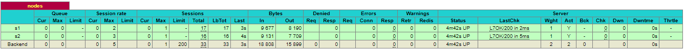
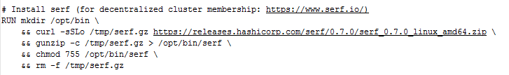
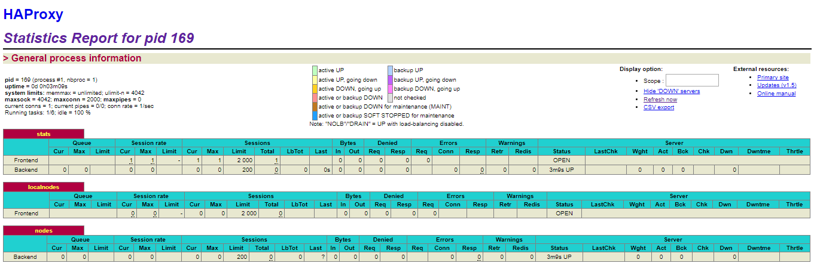
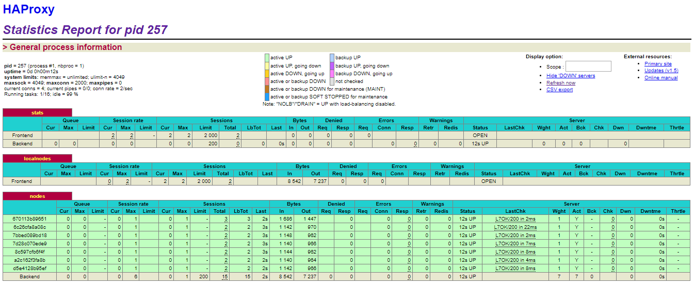
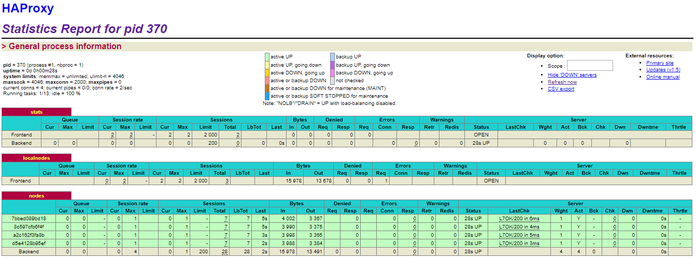

# AIT Lab04 - DOCKER AND DYNAMIC SCALING
#### Auteurs : Julien Brêchet et Adrien Marco
#### Date : 2017-12-08

#### URL du projet : [https://github.com/JulienBrechet/Teaching-HEIGVD-AIT-2016-Labo-Docker](https://github.com/JulienBrechet/Teaching-HEIGVD-AIT-2016-Labo-Docker)

## Table des matières
1.	[Important !](#Important)
2.	[Introduction](#Introduction)
3.	[Task 0 : Identify issues and install the tools](#T0)
4.	[Task 1 : Add a process supervisor to run several processes](#T1)
5.	[Task 2 : Add a tool to manage membership in the web server cluster](#T2)
6.	[Task 3 : React to membership changes](#T3)
7.	[Task 4 : Use a template engine to easily generate configuration files](#T4)
8.	[Task 5 : Generate a new load balancer configuration when membership changes](#T5)
9.	[Task 6 : Make the load balancer automatically reload the new configuration](#T6)
10.	[Difficultés rencontrées](#Difficultes)
11.	[Conclusion](#Conclusion)

## Important ! 
Il faut absolument créer notre propre réseau Docker en mode bridge (ici le réseau `heig`). Sinon on ne pourra pas lancer correctement nos containers et utiliser notre architecture de load balancing. La commande à effectuer est la suivante :

	docker network create --driver bridge heig

## Introduction 
Dans ce laboratoire, on va manipuler un HAProxy et des serveurs nodes à travers des containers Docker. On va devoir utiliser entre autres un superviseur de processus, un template engine et un cluster membership management tool et on va améliorer petit à petit notre architecture afin de la rendre le plus dynamique possible. C'est-à-dire qu'on va ajouter et supprimer dynamiquement les nodes arrivant et sortants dans le mécanisme de load balancing. On va devoir pour cela utiliser les outils précités afin d'automatiser le processus.

## Task 0 : Identify issues and install the tools 

[M1]	**Do you think we can use the current solution for a production environment? What are the main problems when deploying it in a production environment?**

La solution actuelle n'est pas idéale si on se trouve dans un environnement de production. Si on doit ajouter un nouveau serveur c'est possible mais on doit le créer et le configurer manuellement et cela peut prendre du temps. L'idéal serait de pouvoir ajouter des serveurs facilement et de façon automatique.

[M2]	**Describe what you need to do to add new webapp container to the infrastructure. Give the exact steps of what you have to do without modifiying the way the things are done. Hint: You probably have to modify some configuration and script files in a Docker image.**

Dans la configuration du HAProxy `haproxy.cfg`, on veut ajouter un nouveau node (serveur) qui sera utilisé dans le mécanisme de load balancing. On ajoute pour ce faire la ligne suivante  :

	server s3 <s3>:3000 check

Il faut aussi modifier le script `run.sh` pour que le HAProxy prenne en compte qu'il y a un troisième serveur. On ajoute la ligne ci-dessous :

	sed -i 's/<s3>/$S3_PORT_3000_TCP_ADDR/g' /usr/local/etc/haproxy/haproxy.cfg

Dans le script `start-containers.sh`, il faut ajouter la commande pour run le troisième serveur :

	docker run -d --name s3 softengheigvd/webapp

Maintenant, puisqu'on a modifié des scripts et la configuration du HAProxy, on doit créer un nouveau container à partir de la nouvelle image modifiée du HAProxy. Ceci afin que les changements effectués soient pris en compte :

	docker build -t softengheigvd/ha

Une fois cela fait, on peut lancer le container nouvellement créé (sans oublier chaque link pour S1, S2 et S3) :

	docker run -d  -p 80:80 -p 1936:1936 -p 9999:9999 --link s1 --link s2 --link s3 --name ha softengheigvd/ha

[M3]	**Based on your previous answers, you have detected some issues in the current solution. Now propose a better approach at a high level.**

Comme expliqué à la question M1, il faut modifier manuellement la configuration et les scripts de lancement. Cela prend du temps et comme il y a plusieurs fichiers à modifier, une erreur de configuration est vite arrivée et on n'est donc pas à l'abri d'un mauvais fonctionnement.

L'idéal serait donc **d'automatiser l'ajout de nouveaux nodes**. On pourrait mettre en place une sorte de mécanisme qui détecterait quand un nouveau container est lancé (exemple : *docker run -d --name s4 softengheigvd/webapp*) et qui l'ajouterait automatiquement dans le mécanisme de load balancing (*haproxy.cfg*).

Il faudrait aussi faire de même quand un serveur tombe pour le sortir du pool du load balancing.

[M4]	**You probably noticed that the list of web application nodes is hardcoded in the load balancer configuration. How can we manage the web app nodes in a more dynamic fashion?**

On pourrait utiliser un **cluster membership management tool**. Il faudrait mettre tous les containers dans le même cluster afin que chacun puisse notifier les autres containers quand il est ou devient actif.

Exemple : quand un nouveau node arrive, il notifie le HAProxy pour que ce dernier puisse l'ajouter dans le mécanisme de load balancing.

Dans ce laboratoire, on va utiliser le cluster membership management tool **Serf** qui est développé par la société HashiCorp, la même entreprise qui développe Vagrant.

[M5]	**In the physical or virtual machines of a typical infrastructure we tend to have not only one main process (like the web server or the load balancer) running, but a few additional processes on the side to perform management tasks.**

**For example to monitor the distributed system as a whole it is common to collect in one centralized place all the logs produced by the different machines. Therefore we need a process running on each machine that will forward the logs to the central place. (We could also imagine a central tool that reaches out to each machine to gather the logs. That's a push vs. pull problem.) It is quite common to see a push mechanism used for this kind of task.**

**Do you think our current solution is able to run additional management processes beside the main web server / load balancer process in a container? If no, what is missing / required to reach the goal? If yes, how to proceed to run for example a log forwarding process?**

Un seul processus principal tourne dans un container Docker. Si le processus se termine, le container se stoppe lui aussi.

Actuellement avec notre solution, on n'est pas capable de runner des processus additionnels de management. Il faudrait pour cela utiliser un **superviseur de processus**. Ce superviseur serait le processus principal du container et il serait en charge de lancer tous les processus dont on a besoin pour notre container afin que ce dernier puisse faire tourner ces plusieurs processus en même temps.

[M6]	**In our current solution, although the load balancer configuration is changing dynamically, it doesn't follow dynamically the configuration of our distributed system when web servers are added or removed. If we take a closer look at the `run.sh` script, we see two calls to `sed` which will replace two lines in the `haproxy.cfg` configuration file just before we start `haproxy`. You clearly see that the configuration file has two lines and the script will replace these two lines.**

**What happens if we add more web server nodes? Do you think it is really dynamic? It's far away from being a dynamic configuration. Can you propose a solution to solve this?**

Pour avoir une solution entièrement dynamique, il faudrait changer la manière dont on modifie le fichier de configuration `haproxy.cfg`.

On pourrait utiliser un **template engine** pour générer facilement les fichiers de configuration (tâche 4). On utiliserait un template de base avec certains champs (placeholders) qui pourraient être dynamiquement modifiés par le template engine comme par exemple le nom, le numéro de port ou l'adresse IP du node.

Selon Wikipedia, un template engine (ou moteur de template en français) est un logiciel qui peut combiner plusieurs templates avec un modèle de données pour produire un ou plusieurs documents résultats.

1.	**Take a screenshot of the stats page of HAProxy at http://192.168.42.42:1936. You should see your backend nodes.**

	

	Les 2 nodes sont bien visibles et actifs.

## Task 1 : Add a process supervisor to run several processes 

1.	**Take a screenshot of the stats page of HAProxy at http://192.168.42.42:1936. You should see your backend nodes. It should be really similar to the screenshot of the previous task.**

	

2.	**Give the URL of your repository URL**

	[https://github.com/JulienBrechet/Teaching-HEIGVD-AIT-2016-Labo-Docker](https://github.com/JulienBrechet/Teaching-HEIGVD-AIT-2016-Labo-Docker)

2.	**Describe your difficulties for this task and your understanding of what is happening during this task. Explain in your own words why are we installing a process supervisor.**

	La capture ci-dessus de la page du HAProxy montre que l'on a 2 nodes actifs, S1 et S2, tout comme lors du précédent laboratoire.

	Aucune difficulté spécifique n'a été rencontrée, on a déjà eu l'occasion de manipuler Docker dans le cadre d'autres cours et on sait déjà comment fonctionne les builds d'images et les runs des containers.

	Dans cette tâche 1, on a modifié le Dockerfile du HAProxy et de la webapp pour pouvoir **installer le processus de supervision S6** lors du build des 2 images. On a modifié l'entrypoint pour que S6 soit le processus principal lorsqu'on lance un container. On a aussi dû faire quelques modifications dans l'arborescence du projet et remplacer dans les scripts `run.sh` la ligne `#!/bin/sh` par `#!/usr/bin/with-contenv bash` et les renommer en `run` tout court. Ceci afin que S6 puisse fournir les variables d'environnement des containers pour le script `run` (ceci est indiqué dans la donnée du laboratoire).

## Task 2 : Add a tool to manage membership in the web server cluster 

1.	**Provide the docker log output for each of the containers: `ha`, `s1` and `s2`.**

	On lance premièrement `ha` puis ensuite les backend nodes `s1` et `s2`. Voici les logs pour chaque container :

	[ha](../logs/task2/ha.log) 
	[s1](../logs/task2/s1.log) 
	[s2](../logs/task2/s2.log)

2.	**Give the answer to the question about the existing problem with the current solution.**

	Comme expliqué dans la donnée du laboratoire, il y a un problème avec la manière dont nous créons le cluster Serf. Quand on lance le HAProxy en premier, il ne va pas se lancer tant que les deux nodes `S1` et `S2` ne sont pas lancés eux aussi car on fait un link sur `S1` et `S2` quand on lance `ha` (commande `docker run -d -p 80:80 -p 1936:1936 -p 9999:9999 --network heig --link s1 --link s2 --name ha softengheigvd/ha`).

	Et si on lance les nodes en premier, il y aura une erreur avec Serf car les nodes tentetont de se connecter au cluster de `ha` mais ce dernier n'étant pas encore lancé, cela ne fonctionnera pas.

	Une option serait de ne pas créer de liens avec les nodes (pas de `--link s1 --link s2`) au lancement de `ha` et d'utiliser un script permettant d'ajouter les nodes au mécanisme de load balancing lorsque les nodes deviennent actifs (ou de les supprimer du mécanisme s'ils tombent).

3.	**Give an explanation on how `Serf` is working. Read the official website to get more details about the `GOSSIP` protocol used in `Serf`. Try to find other solutions that can be used to solve similar situations where we need some auto-discovery mechanism.**

	Serf est un decentralized cluster membership management tool (outil décentralisé de gestion d'appartenance au cluster en français) qui permet de mettre les containers dans un même cluster afin que chacun puisse notifier les autres containers quand il est ou devient actif.

	Serf utilise le protocole `GOSSIP` (basé sur SWIM) pour communiquer avec les nodes. L'agent Serf échange périodiquement des messages avec les autres nodes. Quand un node reçoit un message GOSSIP pour la première fois, il apprend à son tour à envoyer des messages. Ainsi, les messages GOSSIP convergent très rapidement sur tous les nodes du réseau.

	GOSSIP offre aussi un mécanisme pour détecter si un node tombe en panne (failure detection). Il est donc possible avec Serf de détecter rapidement si un node tombe en panne et d'avertir les autres membres du cluster.

	Serf peut aussi broadcaster des events personnalisés, comme par exemple lancer un script ajoutant dans le mécanisme de load balancing le node qui vient de rejoindre le cluster.

	Références : [https://www.serf.io](https://www.serf.io) et [https://www.serf.io/docs/internals/simulator.html](https://www.serf.io/docs/internals/simulator.html)

## Task 3 : React to membership changes 

1.	**Provide the docker log output for each of the containers: `ha`, `s1` and `s2`.**

	[Logs de ha lancé seul](../logs/task3/ha.log) 
	[Logs de s1](../logs/task3/s1.log) 
	[Logs de ha après que s1 soit lancé](../logs/task3/ha_after_s1.log) 
	[Logs de s2](../logs/task3/s2.log)

2.	**Provide the logs from the `ha` container gathered directly from the `/var/log/serf.log` file present in the container.**

	[Logs générés dans les scripts handlers de Serf](../logs/task3/ha_serf_custom_logs.log)

## Task 4 : Use a template engine to easily generate configuration files 

1.	**You probably noticed when we added `xz-utils`, we have to rebuild the whole image which took some time. What can we do to mitigate that? Take a look at the Docker documentation on image layers. Tell us about the pros and cons to merge as much as possible of the command. In other words, compare:**

		Manière 1 :

		RUN command 1
		RUN command 2
		RUN command 3

	**vs.**

		Manière 2 :

		RUN command 1 && command 2 && command 3

	**There are also some articles about techniques to reduce the image size. Try to find them. They are talking about `squashing` or `flattening` images.**

	Une image Docker référence une liste de couches (layers) qui représentent les différences dans le système de fichier, un peu à la manière des mécanismes de Snapshot.

	A chaque fois qu'on lance une commande (`RUN` ...), on ajoute une nouvelle couche sur l'image Docker. Donc la première manière ajoute 3 couches sur l'image Docker alors que la seconde manière n'en ajoute qu'une seule car on effectue les 3 commandes avec un seul `RUN`.

	Plus il y a de couches, plus il y a d'indirections à effectuer pour accéder aux données qui nous intéressent. Cela signifie que **plus il y a de couches lorsqu'on build l'image, plus l'accès aux données d'un container basé sur cette image est lent**.

2.	**Propose a different approach to architecture our images to be able to reuse as much as possible what we have done. Your proposition should also try to avoid as much as possible repetitions between your images.**

	Il faut effectuer le plus possible de commandes selon la manière 2 de la question précédente. Il faut utiliser le moins de `Run` possible et combiner plusieurs commandes avec `&&`.

	Voici par exemple ci-dessous un cas concret d'utilisation dans ce laboratoire. On a tout d'abord créé un nouveau répertoire et ensuite on a téléchargé avec `curl` le zip de l'outil Serf pour ensuite le dézipper dans `/opt/bin/serf`, modifier les droits d'accès du répertoire `/opt/bin/serf` et pour finir supprimer le zip dont on n'a plus besoin.

	

	Même si on a effectué plusieurs commandes, on a effectué un seul `RUN`. Cela signifie qu'on a rajouté une seule couche sur l'image Docker. Si on avait fait un `RUN` pour chacune de ces commandes ci-dessus, on aurait ajouté 5 couches au lieu d'une seule, ce qui peut rapidement augmenter avec toutes les commandes à effectuer dans le `Dockerfile` et ainsi rendre très lent l'accès aux données d'un container runnant l'image en question !

3.	**Provide the `/tmp/haproxy.cfg` file generated in the `ha` container after each step.**

	[Contenu du fichier temporaire haproxy.cfg](../logs/task4/haproxy.cfg.log) 
	[Contenu du fichier temporaire haproxy.cfg après l'arrivée de s1](../logs/task4/haproxy.cfg_after_s1.log) 
	[Contenu du fichier temporaire haproxy.cfg après l'arrivée de s2](../logs/task4/haproxy.cfg_after_s2.log)

	**In addition, provide a log file containing the output of the `docker ps` console and another file (per container) with `docker inspect <container>`.**

	[docker ps](../logs/task4/docker_ps.log) 
	[docker inspect ha](../logs/task4/docker_inspect_ha.log) 
	[docker inspect s1](../logs/task4/docker_inspect_s1.log) 
	[docker inspect s2](../logs/task4/docker_inspect_s2.log)

4.	**Based on the three output files you have collected, what can you say about the way we generate it? What is the problem if any?**

	L'inconvénient ici est qu'on récupère manuellement un fichier temporaire que l'on a créé lorsqu'on a lancé un container. Il faudrait pouvoir ajouter (ou supprimer) automatiquement ces lignes directement dans le fichier de configuration `haconfig.cfg` lorsqu'un node arrive (ou sort) du cluster.

## Task 5 : Generate a new load balancer configuration when membership changes 

1.	**Provide the file `/usr/local/etc/haproxy/haproxy.cfg` generated in the `ha` container after each step.**

	[Contenu du fichier de config haproxy.cfg](../logs/task5/haproxy.cfg.log) 
	[Contenu du fichier de config haproxy.cfg après l'arrivée de s1](../logs/task5/haproxy.cfg_after_s1.log) 
	[Contenu du fichier de config haproxy.cfg après l'arrivée de s2](../logs/task5/haproxy.cfg_after_s2.log)

	**In addition, provide a log file containing the output of the `docker ps` console and another file (per container) with `docker inspect <container>`.**

	[docker ps](../logs/task5/docker_ps.log) 	
	[docker inspect ha](../logs/task5/docker_inspect_ha.log) 
	[docker inspect s1](../logs/task5/docker_inspect_s1.log) 
	[docker inspect s2](../logs/task5/docker_inspect_s2.log)

2.	**Provide the list of files from the `/nodes` folder inside the `ha` container.**

	[Liste des fichiers dans `/nodes`](../logs/task5/nodes.log)

3.	**Provide the configuration file after you stopped one container and the list of nodes present in the `/nodes` folder.**
	
	[Contenu du fichier de config haproxy.cfg](../logs/task5/haproxy.cfg_after_s1_stopped.log) 
	[Liste des fichiers dans `/nodes`](../logs/task5/nodes_after_s1_stopped.log)

	**In addition, provide a log file containing the output of the `docker ps` console.**

	[docker ps](../logs/task5/docker_ps_after_s1_stopped.log)
	

## Task 6 : Make the load balancer automatically reload the new configuration 

1.	**Take a screenshots of the HAProxy stat page showing more than 2 web applications running. Additional screenshots are welcome to see a sequence of experimentations like shutting down a node and starting more nodes.**

	#### Lancement du HAProxy uniquement

	 
	[Contenu du fichier de config haproxy.cfg](../logs/task6/haproxy.cfg.log) 
	[docker ps](../logs/task6/docker_ps.log)

	On constate qu'aucun node n'est actif.

	#### Lancement de 7 nodes (s1 à s7)

	Lancement du script `start_some_nodes.sh` :

	 
	[Contenu du fichier de config haproxy.cfg](../logs/task6/haproxy.cfg_after_run_7nodes.log) 
	[Liste des fichiers dans `/nodes`](../logs/task6/nodes_after_run_7nodes.log) 
	[docker ps](../logs/task6/docker_ps_after_run_7nodes.log)
	 

	On voit bien dans la capture ci-dessus que 7 nodes sont maintenant actifs. On peut le constater aussi en consultant le fichier `haproxy.cfg` ou l'affichage de la commande `docker ps`.

	#### Suppression de 3 nodes (s2, s6 et s4)

	Lancement du script `stop_some_nodes.sh` :

	 
	[Contenu du fichier de config haproxy.cfg](../logs/task6/haproxy.cfg_after_stop_3nodes.log) 
	[Liste des fichiers dans `/nodes`](../logs/task6/nodes_after_stop_3nodes.log) 
	[docker ps](../logs/task6/docker_ps_after_stop_3nodes.log) 

	On constate dans la capture ci-dessus et dans les différents logs qu'il ne reste plus que 4 nodes actifs, ce qui est correct. Puisque l'on a arrêté les nodes s2, s6 et s4, il ne reste plus que les 4 nodes actifs suivants : s1, s3, s5, s7.

2.	**Give your own feelings about the final solution. Propose improvements or ways to do the things differently. If any, provide references to your readings for the improvements.**

	La solution finale de ce laboratoire fonctionne correctement. Mais ça aurait été mieux d'utiliser une solution Docker intégrant nativement les fonctions de clustering.

	Pour cela il existe l'outil [Docker Swarm](https://www.pluralsight.com/courses/docker-swarm-native-docker-clustering) (dont nous avions déjà entendu parler) qui intègre le **Native Docker Clustering**. *Docker Swarm* offre une meilleure scalabilité car il est beaucoup plus facile de gérer le clustering de nos machines Docker par rapport à ce qu'on a fait durant notre laboratoire.

3.	**Present a live demo where you add and remove a backend container.**

	Démonstration effectuée le 22.12.2017 en présence de professeur et de l'assistant.

## Difficutés rencontrées 

Ce laboratoire n'a pas été trop difficile car la majeure partie des commandes et des configurations nous ont été données. Mais il nous a pris tout de même un temps considérable à réaliser à cause des nombreuses recherches à effectuer pour répondre aux parties théoriques.

## Conclusion 

Ce laboratoire a été très intéressant à réaliser. Il nous a permi d'acquérir de nouvelles connaissance dans le domaine des HAProxy et du load balancing en général. Ce laboratoire nous a aussi permi de connaître et d'apprendre à utiliser certains outils tels que *Serf*, *S6* ou *Handlebars*.

Par contre petit bémol, certaines questions théoriques demandaient de répondre plus ou moins bêtement ce qui était écrit sur le site de l'élément à étudier (par exemple des question sur l'outil `Serf` sur [serf.io](serf.io). Cela nous force certes à bien nous documenter pour répondre à la question, mais cela ne nous a pas paru d'une grande nécessité.

Néanmoins, ce laboratoire nous a été utile pour mieux comprendre la matière d'AIT sur le load balancing et cela nous sera probablement très utile pour notre parcours professionnel.
